  This Genesys Cloud Developer Blueprint explains how to set up Genesys Cloud and Microsoft Azure Active Directory to update a Genesys Cloud agent's presence in Microsoft Teams at the start and end of an inbound Genesys Cloud voice interaction.

  When an Architect workflow receives an inbound interaction, a Microsoft Graph API call is sent to the Microsoft Teams user that is associated with the Genesys Cloud agent who is assigned to the interaction. The Microsoft Teams user's presence is set to "Do Not Disturb" when the voice interaction begins. When the interaction ends, the Microsoft Teams user's presence is set to "Available."

The following illustration shows this solution from an agent’s point of view.

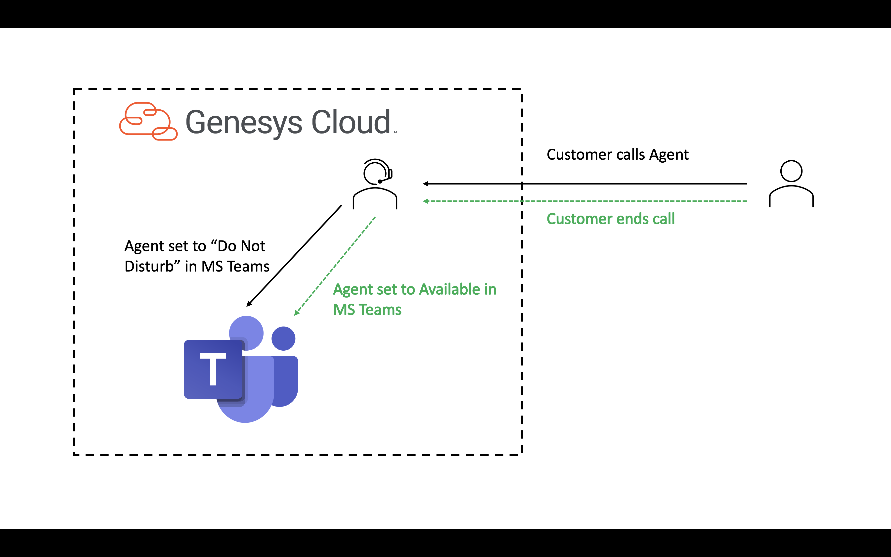

The following shows the end-to-end agent experience that this solution enables.

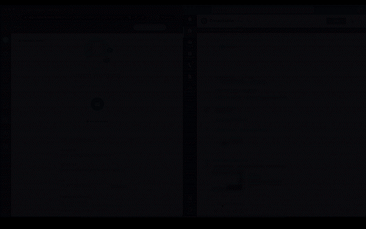

To trigger Microsoft Teams presence updates from Genesys Cloud, you use several public APIs that are available from Genesys Cloud and Microsoft Graph. The following illustration shows the API calls between Genesys Cloud and Microsoft 365.

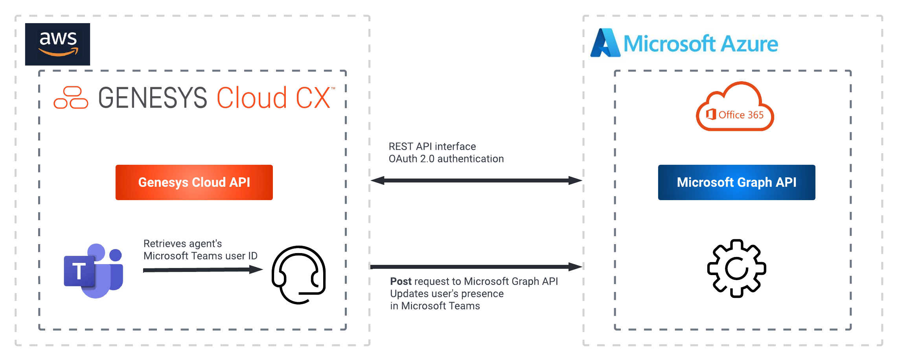

## Solution components

* **Genesys Cloud** - A suite of Genesys cloud services for enterprise-grade communications, collaboration, and contact center management. Contact center agents use the Genesys Cloud user interface.
* **Genesys Cloud API** - A set of RESTful APIs that enables you to extend and customize your Genesys Cloud environment.
* **Microsoft Teams** - A meeting and communication app. Microsoft Teams is the app that hosts the meeting for this solution.
* **Microsoft Graph** - A unified API endpoint that enables developers to integrate services and devices with Microsoft products. This solution uses the API endpoint to update a users presence in Microsoft Teams.
* **Microsoft Azure** - A cloud computing platform that provides a variety of cloud services for building, testing, deploying, and managing applications through Microsoft-managed data centers. Microsoft Azure hosts Microsoft 365.
* **Postman** - A platform for creating and sharing APIs.

## Prerequisites

### Specialized knowledge

* Administrator-level knowledge of Genesys Cloud
* Administrator-level knowledge of Microsoft Azure Active Directory
* Experience with REST API authentication
* Experience with Postman

### Genesys Cloud account

* A Genesys Cloud 3 license. For more information, see [Genesys Cloud Pricing](https://www.genesys.com/pricing "Opens the pricing article").
* The Master Admin role in Genesys Cloud. For more information, see [Roles and permissions overview](https://help.mypurecloud.com/?p=24360 "Opens the Roles and permissions overview article") in the Genesys Cloud Resource Center.
* The Microsoft Azure Active Directory SCIM integration for Microsoft Teams must be implemented in your Genesys Cloud organization. For more information, see [Configure the Microsoft Teams integration](https://help.mypurecloud.com/?p=222880) in the Genesys Cloud Resource Center.
* Event Orchestration must be activated for your Genesys Cloud organization.

### Microsoft account

* A Microsoft account with an Azure Enterprise Agreement (Azure EA) is required. Individual Azure accounts do not support the OAuth client with the client credentials grant type that is required for this solution.
* An Azure Active Directory (Azure AD) account with admininstrator-level permissions to set up authorization and grant permissions for Genesys Cloud
* Microsoft Teams license for each agent

## Configure the Azure custom app

To enable the Genesys Cloud instance to authenticate, read, and write presence information from the Graph API for Microsoft Teams, register your custom app in Azure.

1. Log in to the Azure portal.
2. Navigate to **App registrations** and click **New registration**.

   

3. Enter a name for the application and select your preferred supported account type. Any account type works for a single Genesys Cloud organization. Click **Register**.

   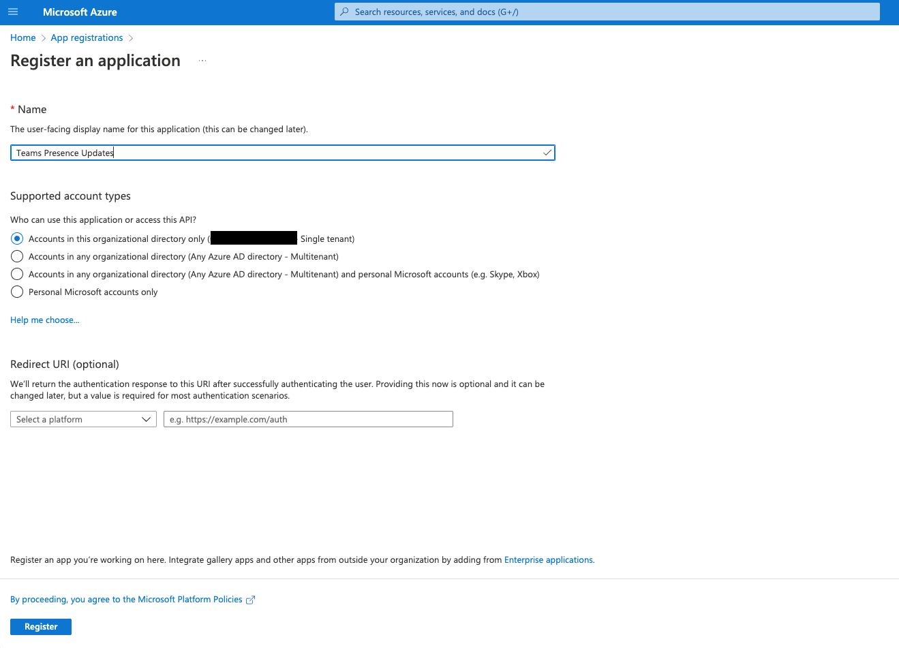

4. On the application's Overview page, copy the values in the **Application (client) ID** and **Directory (tenant) ID** fields for later use.

   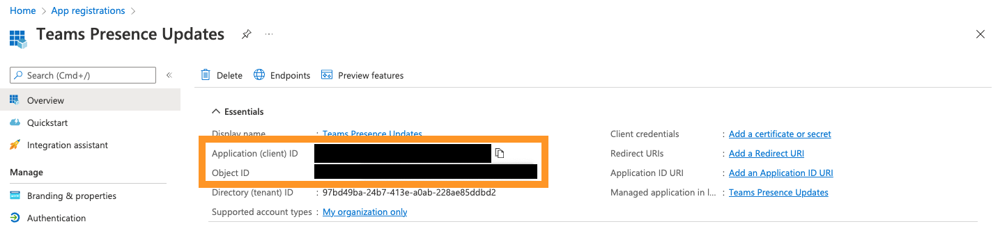

5. Click **Certificates & secrets** and then click **New client secret**.

   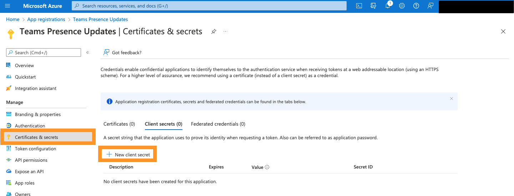

6. Copy the client secret value for later use.

   :::primary
   **Note:** You cannot view or retrieve the client secret value later.
   :::

   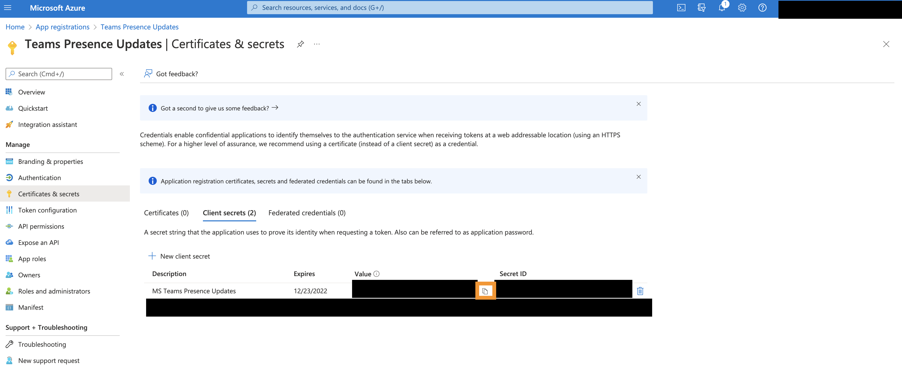

7. Click **API Permissions** and click **Add a permission**.

   

8. Click **Microsoft Graph**.

   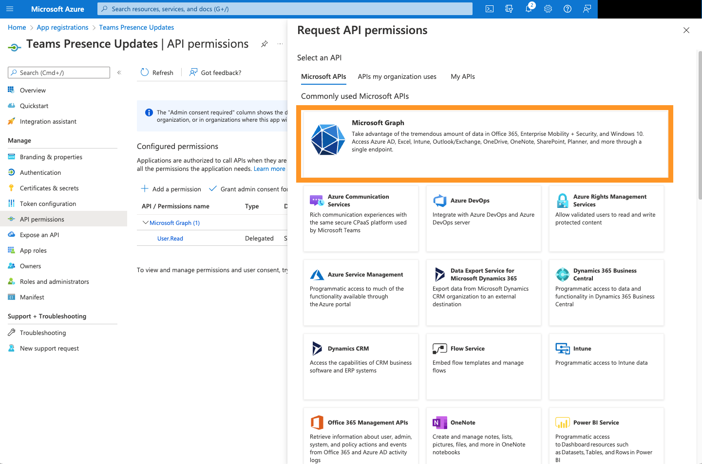

9. Click **Application permissions**.

    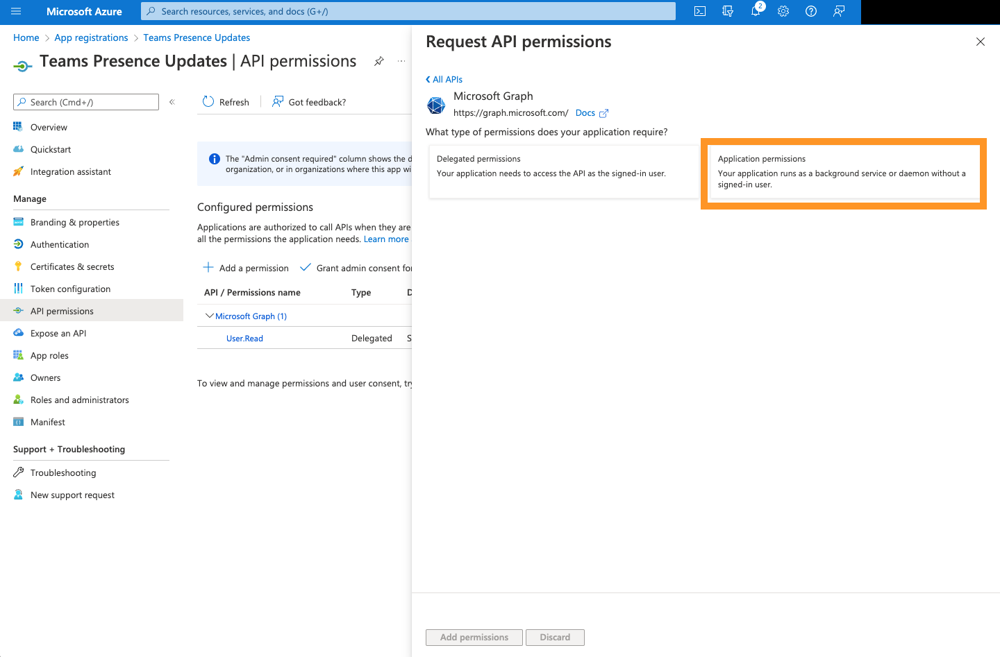

10. Search for `Presence`, expand the **Presence** section, select the **Presence.ReadWrite.all** permission, and click **Add permissions**.

    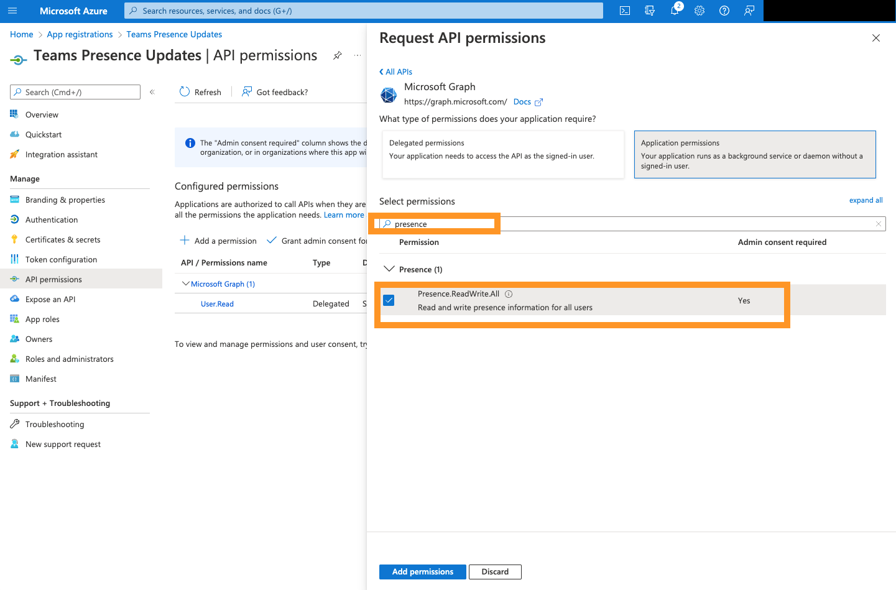

11. Click **Grant Admin Consent**.

    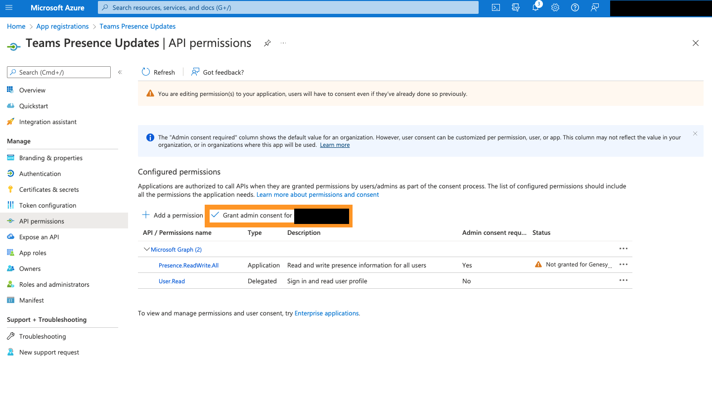

12. Click **Yes** in the confirmation modal.

    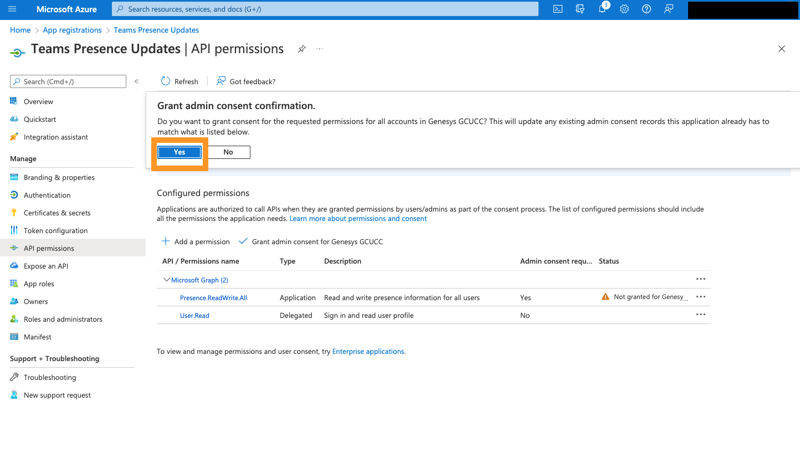

13. Verify that the admin consent is granted.

    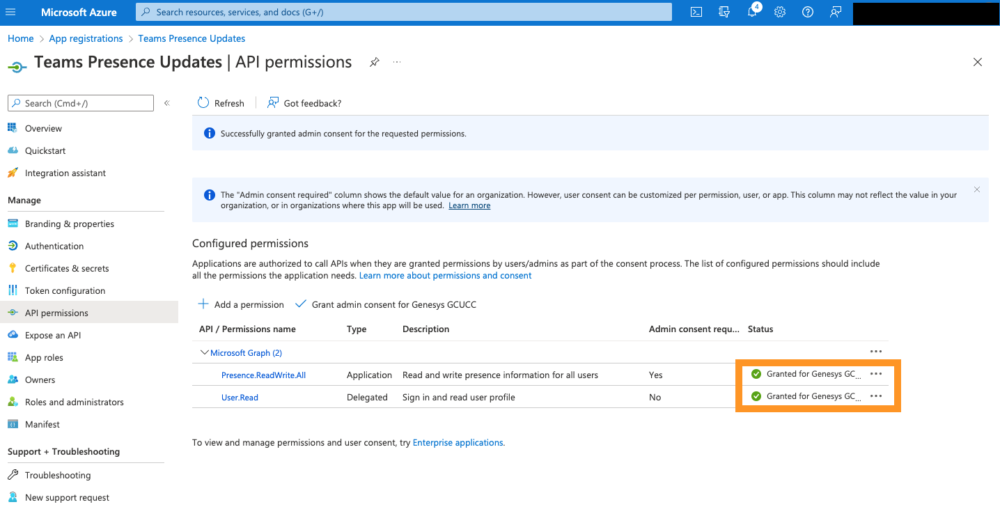

## Configure Genesys Cloud

### Add a web services data actions integration

To enable communication from Genesys Cloud to Microsoft Azure and Microsoft Teams, add a web services data actions integration:

1. In Genesys Cloud, navigate to **Admin** > **Integrations** and install the **Web Services Data Actions** integration from Genesys Cloud. For more information, see [About the data actions integrations](https://help.mypurecloud.com/?p=209478 "Opens the data actions overview article") in the Genesys Cloud Resource Center.

   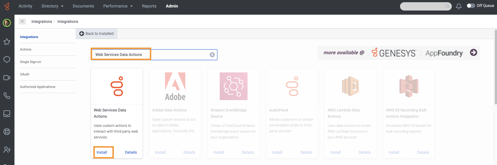

2. Rename the web services data action and provide a short description.

   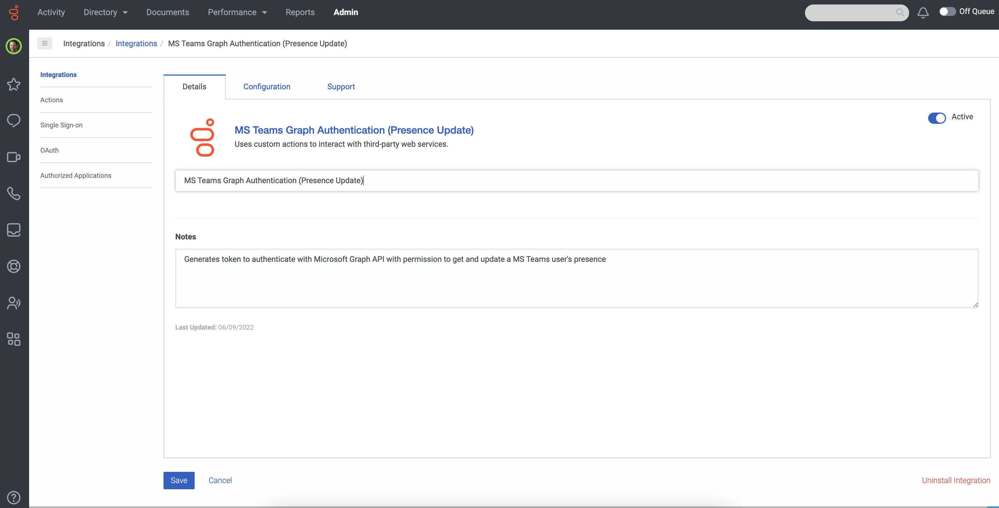

3. Click **Configuration** > **Credentials** and then click **Configure**.

   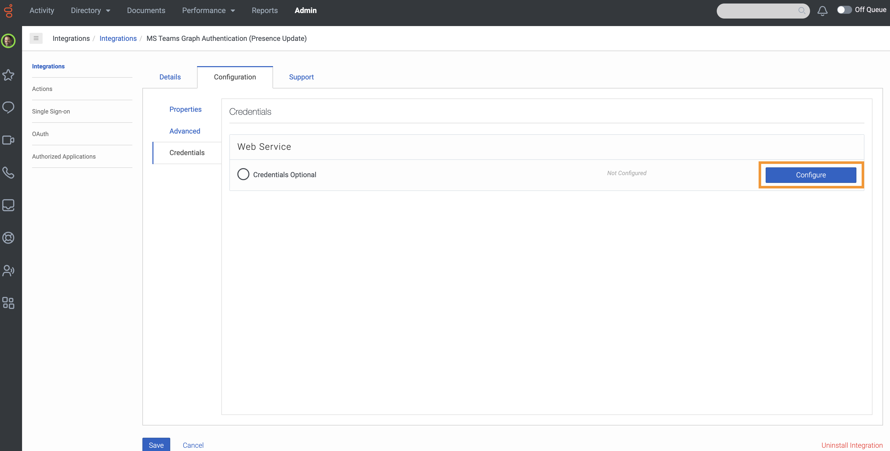

4. From the **Credential Type** list, select **User Defined (OAuth)** and specify the following options:

* **client_id** Use the application (client) ID from your Azure custom app.
* **client_secret** Use the client secret from your Azure custom app.
* **tenant_id** Use the directory (tenant) ID from your Azure custom app
* **scope**: Use https://graph.microsoft.com/.default.
* **grant_type**: Select client_credentials.

   

 5. Click **Save**.

    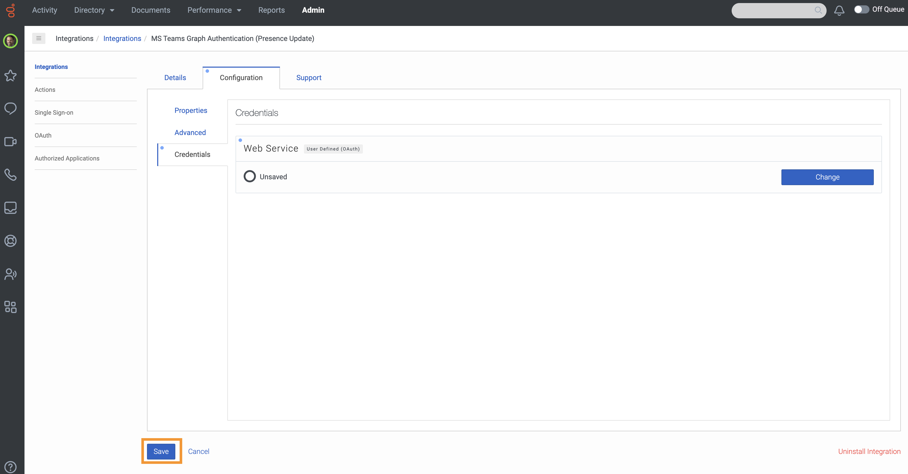

### Import the authentication data action

When you add a web services data actions integration in your organization, Genesys Cloud automatically creates a **Custom Auth** data action. You import this authentication data action into another data action.

1. Navigate to **Admin** > **Integrations** > **Actions** and open the **Custom Auth** data action.

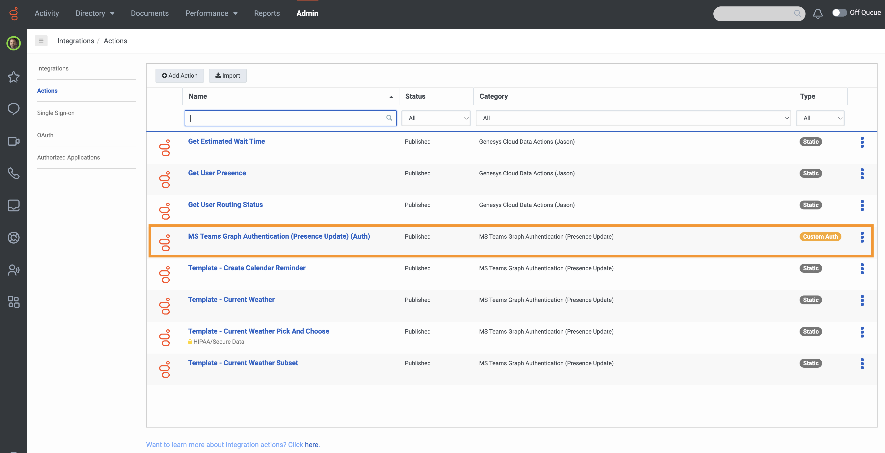

2. Go to the bottom of the Custom Auth data action page. To change the status of the data action from **Published** to **Draft**, click **Viewing**.

3. From the [update-ms-teams-presence-from-inbound-interaction](https://github.com/jasonwolfg/update-ms-teams-presence-from-inbound-interaction "Opens the GitHub repo") GitHub repository, download the Office-365-Auth.customAuth.json file.
4. In Genesys Cloud, click **Import** and browse to select the downloaded file.

    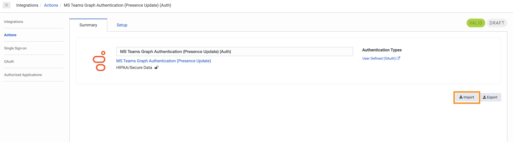

5. Click **Import Action**.

  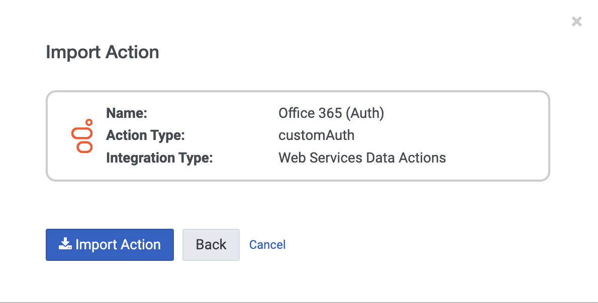

6. Click **Save & Publish**.
  :::primary
  **Note:** To publish the data action, in the Publish Action page, click **Yes**. The import action modifies only the data action configuration and not the data action contract.
  :::

7.  Return to the web services data action integration and verify that the data action has the **Active** status.

### Create a custom role for use with Genesys Cloud OAuth client

1. Navigate to **Admin** > **Roles/Permissions** and click **Add Role**.

   

2. Type a **Name** for your custom role.

  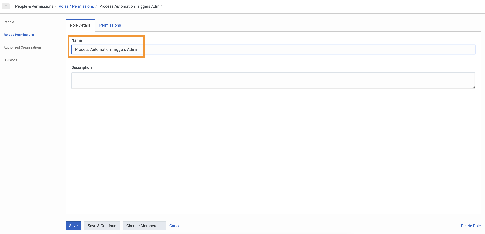

3. Search and select the **processautomation**>**trigger**>**All Permissions** permissions and click **Save** to assign the appropriate permissions to your custom role.

:::primary
**Note:** Assign this role to your user record before creating the Genesys Cloud OAuth client, as described in the next section.  The **processautomation**>**trigger**>**All Permissions** permissions require event orchestration to be activated in your Genesys Cloud organization.
:::

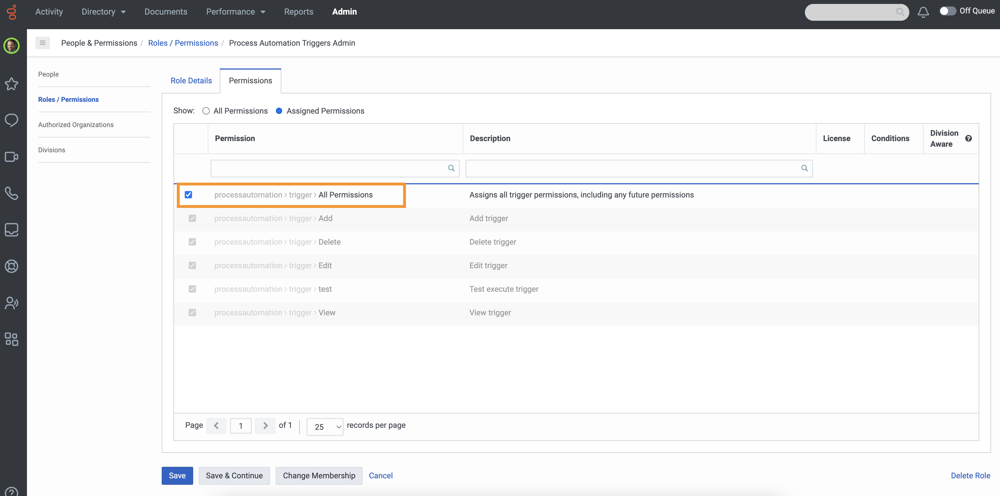

### Create an OAuth client for use with the Genesys Cloud data action integration

To enable a Genesys Cloud data action to make public API requests on behalf of your Genesys Cloud organization, use an OAuth client to configure authentication with Genesys Cloud.

1. Navigate to **Admin** > **Integrations** > **OAuth** and click **Add Client**.

   

2. Enter a name for the OAuth client and select **Client Credentials** as the grant type. Click the **Roles** tab and assign the role for the OAuth client.

     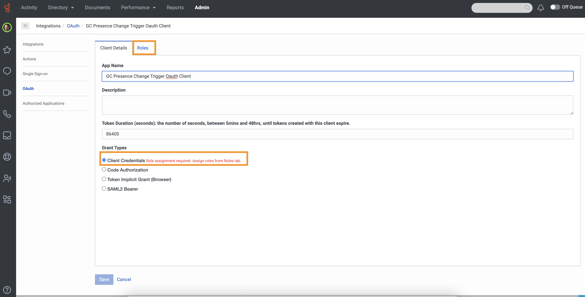

3. Click **Save**. Copy the client ID and the client secret values for later use.

   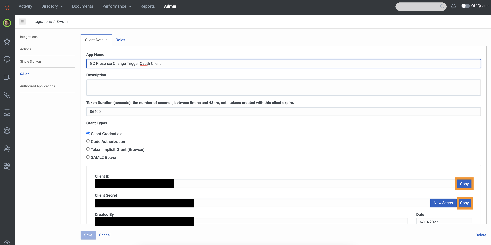

### Add a Genesys Cloud data actions integration

To update a user's presence in Microsoft Teams, get the Microsoft Teams userId that corresponds to the Genesys Cloud agent who will answer the voice interaction. To do this, you call a Genesys Cloud public API. To enable this public API call, add a Genesys Cloud data actions integration.

1. Navigate to **Admin** > **Integrations** > **Integrations** and install the **Genesys Cloud Data Actions** integration. For more information, see [About the data actions integrations](https://help.mypurecloud.com/?p=209478 "Opens the About the data actions integrations article") in the Genesys Cloud Resource Center.

   

2. Enter a name for the Genesys Cloud data action.

   

3. On the **Configuration** tab, click **Credentials** and then click **Configure**.

   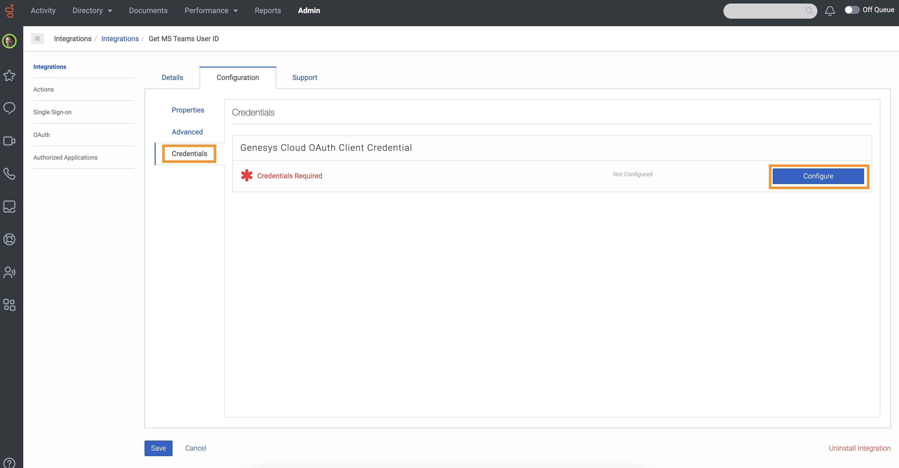

4. Enter the client ID and client secret of the SCIM OAuth client that you used with the [Active Directory Microsoft Teams SCIM integration](#genesys-cloud-account "Goes to the Genesys Cloud account section"). Click **OK** and save the data action.

   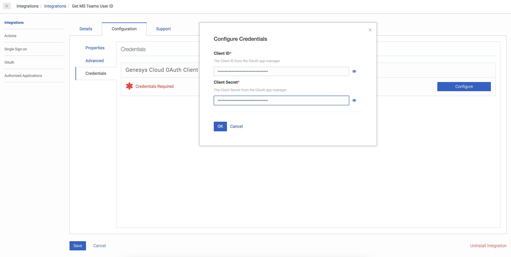

5. Navigate to the main Integrations page and set the Get MS Teams User ID data action integration to **Active**.

   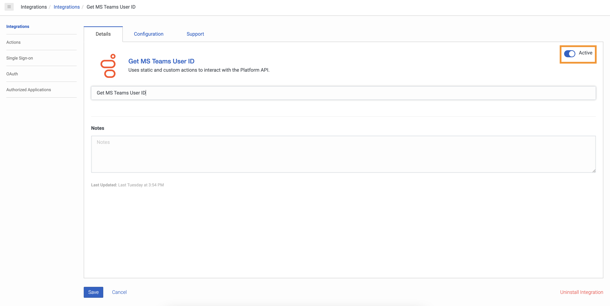

### Import the supporting data actions

To enable both the Genesys Cloud Public API call to get the Microsoft Teams userId and the Microsoft Graph API call to update that Teams user's presence, you must import two more data actions.
* [Import the Find Teams User ID Action](#import-the-find-teams-user-id-data-action "Goes to the Import the Find Teams User ID data action section")
* [Import the Update Teams User Presence Action](#import-the-update-teams-user-presence-action "Goes to the Import the Update Teams User Presence Action section")

### Import the Find Teams User ID data action

The Find the Teams User ID data action uses the authenticated token that is supplied by other data actions to get the Microsoft Teams User ID from the Genesys Cloud Public API.

1. From the [update-ms-teams-presence-from-inbound-interaction repo](https://github.com/GenesysCloudBlueprints/update-ms-teams-presence-from-inbound-interaction-trigger-blueprint "Opens the GitHub repo") GitHub repository, download the Find-Teams-User-Id.custom.json file.

2. In Genesys Cloud, navigate to **Integrations** > **Actions** and click **Import**.

   

3. Select the Find-Teams-User-Id.custom.json file and associate it with the web services data action that you created in the [Add a web services data actions integration](#add-a-web-services-data-actions-integration "Goes to the Add a web services data actions integration section") section, and then click **Import Action**.

   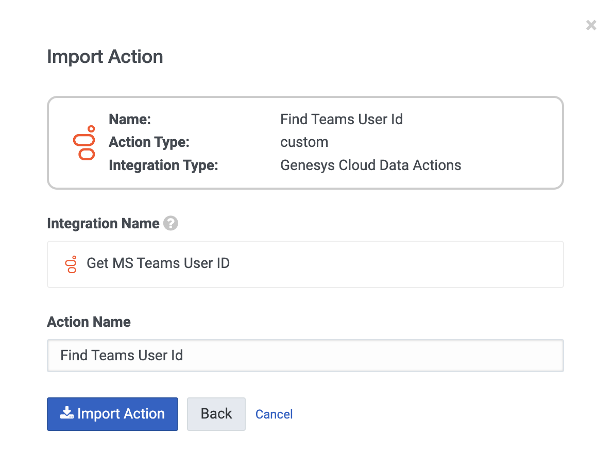

### Import the Update Teams User Presence data action

The Update Teams User Presence data action calls the Microsoft Graph API to update the user's presence in Microsoft Teams.

1. From the [update-ms-teams-presence-from-inbound-interaction repo](https://github.com/GenesysCloudBlueprints/update-ms-teams-presence-from-inbound-interaction-trigger-blueprint "Opens the GitHub repo") GitHub repository, download the Update-Teams-User-Presence.custom.json file.
2. Navigate to **Admin** > **Integrations** > **Actions** and click **Import**.

   

3. Select the Update-Teams-User-Presence.custom.json file and associate it with the web services data action that you created in the [Add a web services data actions integration](#add-a-web-services-data-actions-integration "Goes to the Add a web services data actions integration section") section, and then click **Import Action**.

   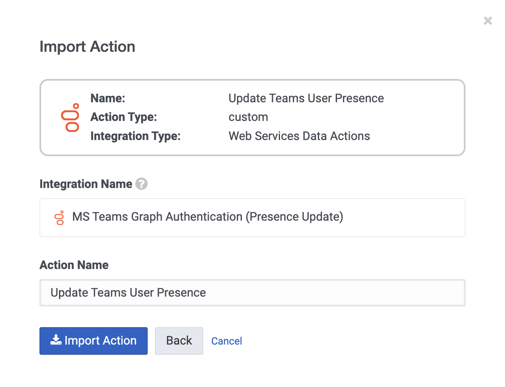

### Import the Architect workflows

This solution includes two Architect workflows that use the data actions you just created. These workflows update the user's presence in Microsoft Teams:

* The **GC User Set MS Teams to DoNotDisturb_v8-0.i3WorkFlow** workflow is triggered when an agent joins an inbound ACD voice interaction. This workflow sets the user's presence in Microsoft Teams to Do Not Disturb.
* The **GC User Set MS Teams to Available_v4-0.i3WorkFlow** workflow is triggered when the inbound ACD interaction ends. This workflow sets the user's presence in Microsoft Teams to Available.

These workflows will be called by the Event Orchestration triggers, which you will create in the next section. When triggered, these Architect workflows will call the Find Teams User ID data action, set the Microsoft Teams User Id variable, and then update the user's presence in Microsoft Teams via the Microsoft Graph API.

First, import these workflows to your Genesys Cloud organization.

1. Download the **GC User Set MS Teams to DoNotDisturb_v8-0.i3WorkFlow** file from the [update-ms-teams-presence-from-inbound-interaction repo](https://github.com/GenesysCloudBlueprints/update-ms-teams-presence-from-inbound-interaction-trigger-blueprint) GitHub repository.

2. In Genesys Cloud, navigate to **Admin** > **Architect** > **Flows:Workflow** and click **Add**.

   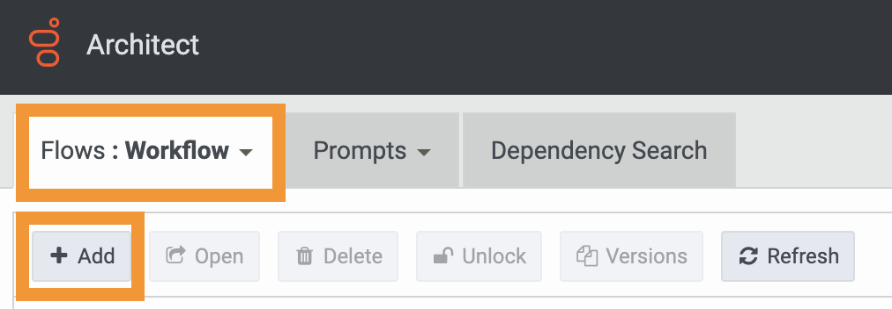

3. Name your workflow and click **Create**.

  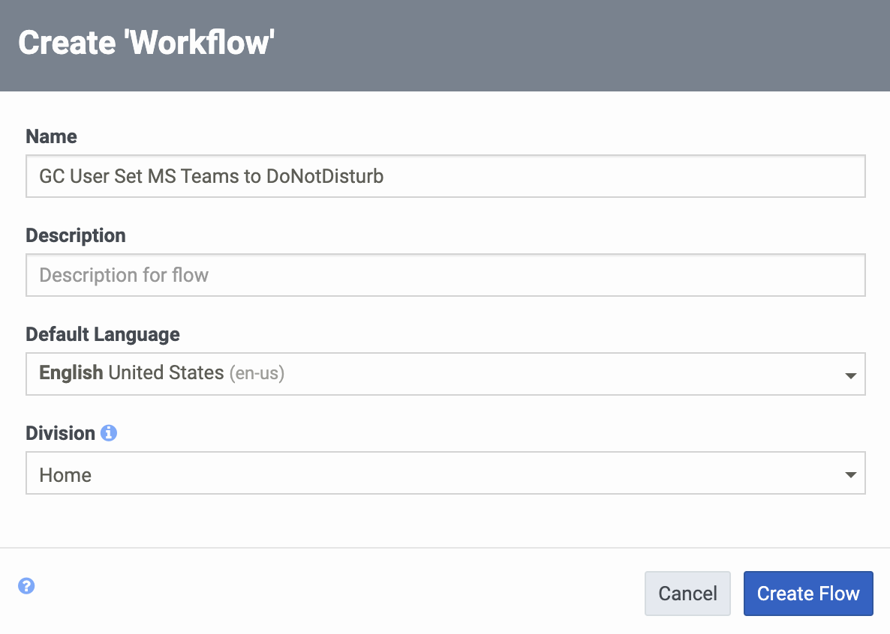

4. From the **Save** menu, click **Import**.

   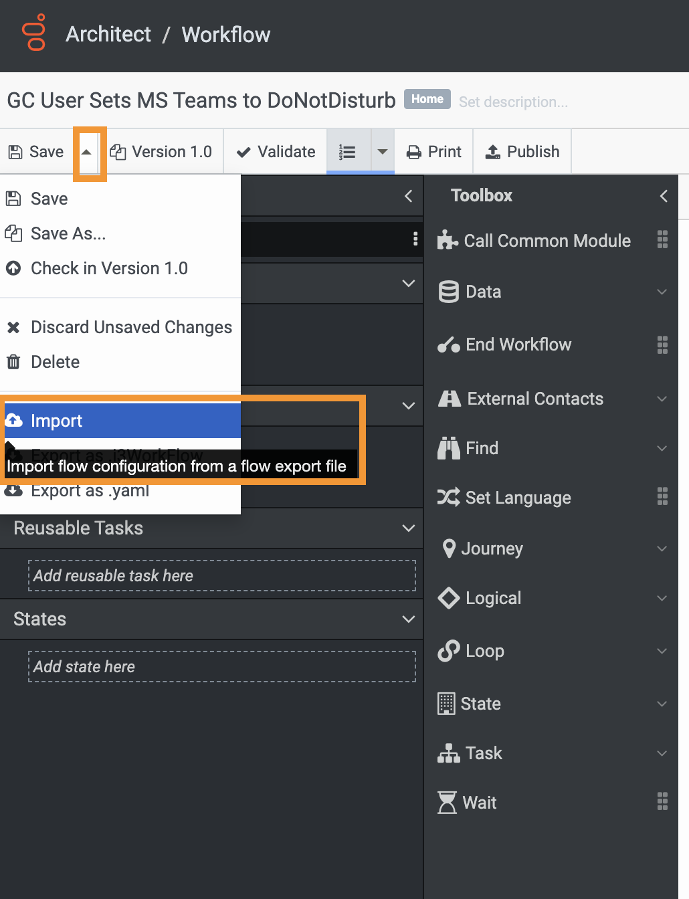

5. Select the downloaded **GC User Set MS Teams to DoNotDisturb_v8-0.i3WorkFlow** file.  Click **Import**.

   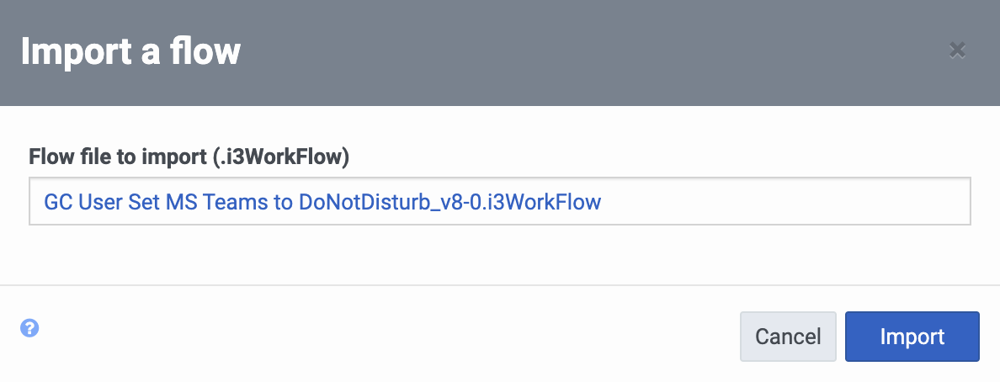

6. Review your workflow. Copy the workflow ID from the URL and save it. You will need it to create the event orchestration trigger. After you have reviewed your workflow, click **Save** and then click **Publish**.

   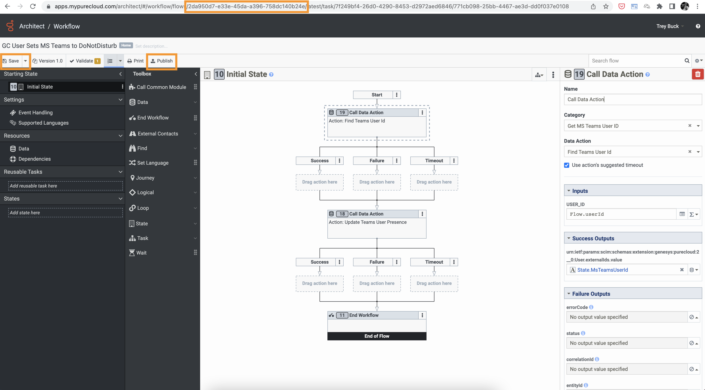

7. Download the **GC User Set MS Teams to Available_v4-0.i3WorkFlow** file from the [update-ms-teams-presence-from-inbound-interaction repo](https://github.com/GenesysCloudBlueprints/update-ms-teams-presence-from-inbound-interaction-trigger-blueprint) GitHub repository.  

8. In Genesys Cloud, navigate to **Admin** > **Architect** > **Flows:Workflow** and click **Add**.

  

9. Name your workflow and click **Create**.

 

10. From the **Save** menu, click **Import**.

  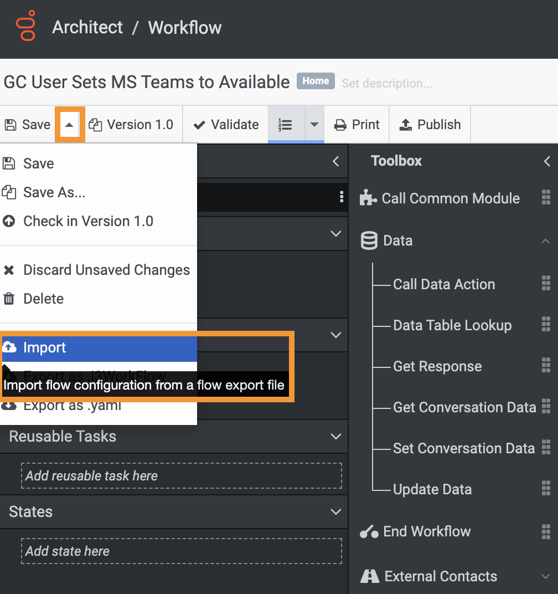

11. Select the downloaded **GC User Set MS Teams to Available_v4-0.i3WorkFlowI’m** file. Click **Import**.

  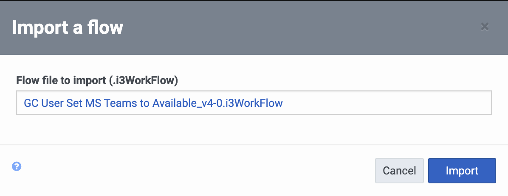

12. Review your workflow. Copy the workflow ID from the URL and save it. You will need it to create the event orchestration trigger. After you have reviewed your workflow, click **Save** and then click **Publish**.

  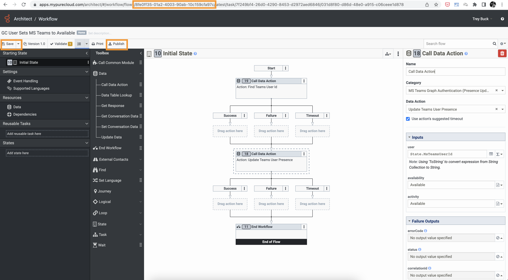

## Create the event orchestration triggers

After you have created the workflows, create the triggers that call them. You need Event Orchestration activated in your Genesys Cloud organization and you need Postman running on your machine.

### Create the first trigger

1. From the [update-ms-teams-presence-from-inbound-interaction repo](https://github.com/GenesysCloudBlueprints/update-ms-teams-presence-from-inbound-interaction-trigger-blueprint) GitHub repository, download the Genesys Cloud Event Orchestration Trigger API's.postman_collection.json file.

2. In Postman, click **Import**

   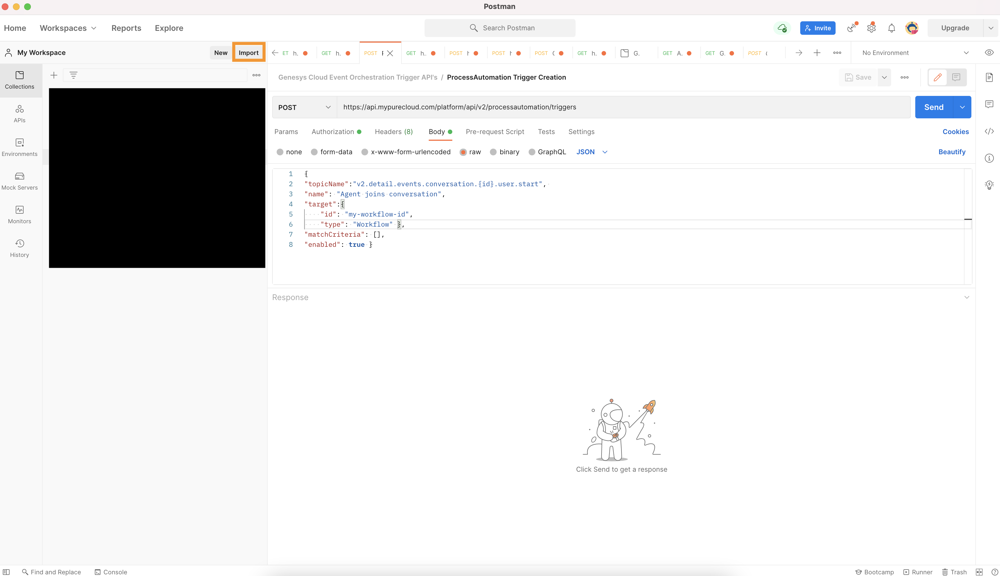

3. Select the Genesys Cloud Event Orchestration Trigger API's.postman_collection.json file and click **Import**

   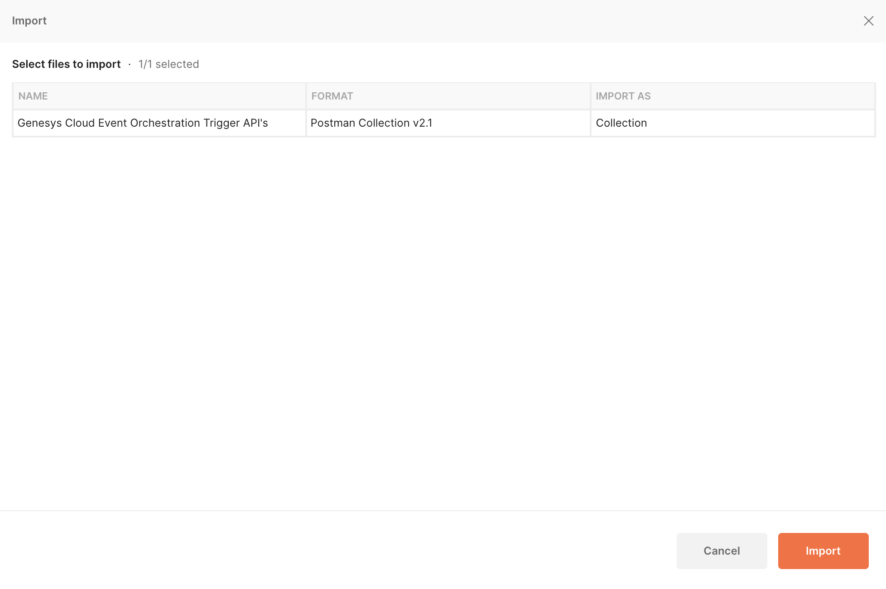

4. In the Genesys Cloud Event Orchestration API's folder, select **Genesys Cloud Client Credential Token Creation**. Change your API domain to match the AWS region in which your Genesys Cloud organization is hosted. The Genesys Cloud organization in this screenshot is hosted in us-east-1.

5. Click the **Authorization** tab. In the **Username** field, paste the client ID from the [OAuth client that you created](#create-an-oauth-client-for-use-with-the-genesys-cloud-data-action-integration "Goes to the Create an OAuth client for use with the Genesys Cloud data action integration section"). In the **Password** field, paste the client secret from the same OAuth client. Click **Send**.

  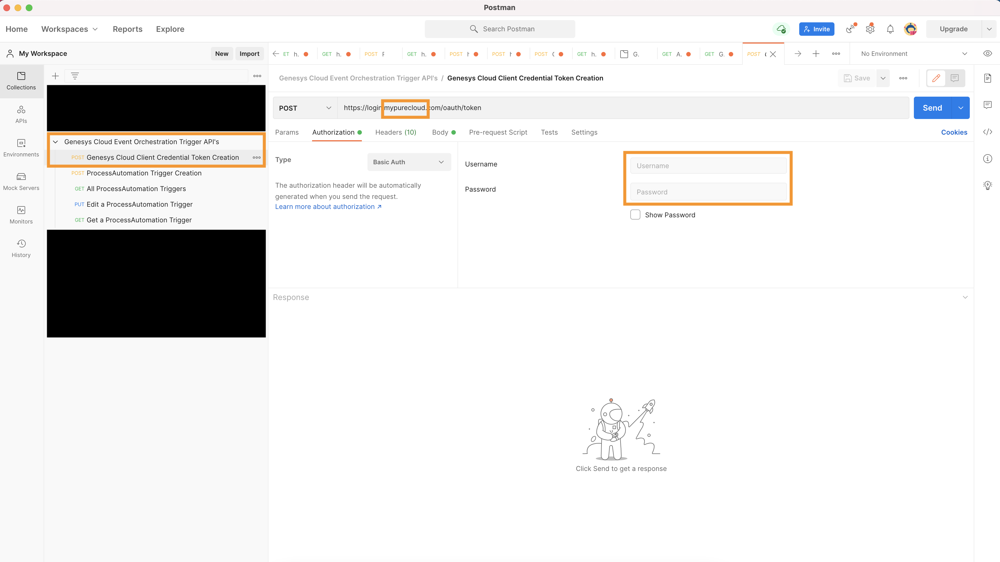

5. From the body of the response, copy the **access token**.

     

6. Click **ProcessAutomation Trigger Creation**. On the **Authentication** tab, select **Bearer Token** and paste the access token from the previous step.

     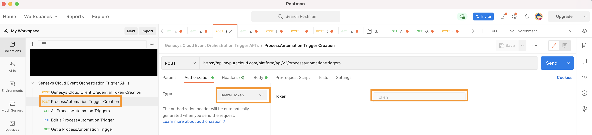

7. Click the **Body** tab. Be sure to change your API domain to match the AWS region your Genesys Cloud organization is hosted.  Replace **my-workflow-id** with the id of the **GC User Set MS Teams to DoNotDisturb** Architect workflow that you created earlier in this blueprint. Click **Send**.

     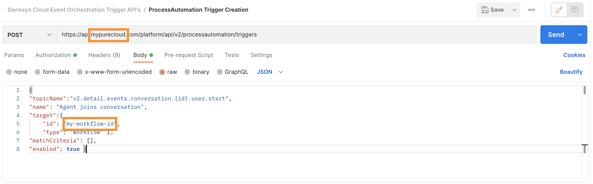

8. To create the second trigger, repeat these steps but change the topicName to `v2.detail.events.conversation.{id}.user.end`. Replace **my-workflow-id** with the ID of the GC User Set MS Teams to Available Architect workflow that you created earlier in this blueprint. Click **Send**.

    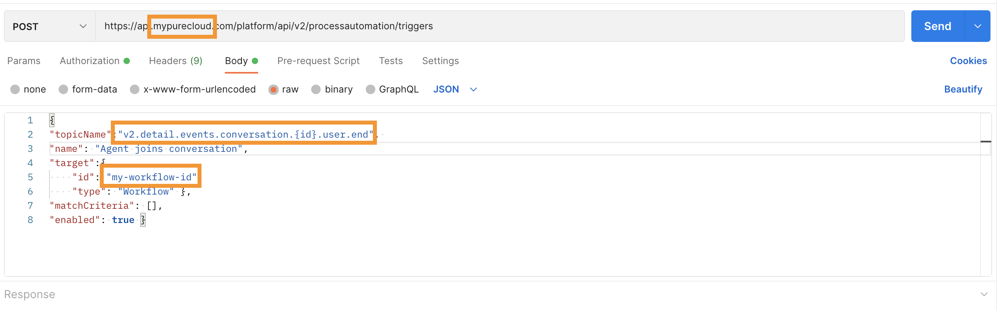

## Additional resources

* [Genesys Cloud notification triggers ("Available topics")](https://developer.genesys.cloud/notificationsalerts/notifications/available-topics "Opens the Available topics page")
* [Prefixes for AWS regions](https://developer.genesys.cloud/platform/api/ "Open the Overview page in the API section of the Genesys Cloud Developer Center")
* [Azure Active Directory](https://azure.microsoft.com/en-us/services/active-directory/ "Goes to the Azure Active Directory page") in the Microsoft documentation
* [Microsoft Azure Enterprise portal](https://docs.microsoft.com/en-us/azure/cost-management-billing/manage/ea-portal-get-started "Goes to the Get started with the Azure Enterprise portal site") in the Microsoft documentation
* [Microsoft Graph presence:setUserPreferredPresence API](https://docs.microsoft.com/en-us/graph/api/presence-setuserpreferredpresence?view=graph-rest-beta&tabs=http "Opens the presence: setUserPreferredPresence page") in the Microsoft Graph API Reference
* [Postman API Platform](https://www.postman.com/ "Goes to the Postman API Platform page") in the Postman documentation
* [update-ms-teams-presence-from-inbound-interaction repo](https://github.com/GenesysCloudBlueprints/update-ms-teams-presence-from-inbound-interaction-trigger-blueprint "Opens the GitHub repo")
